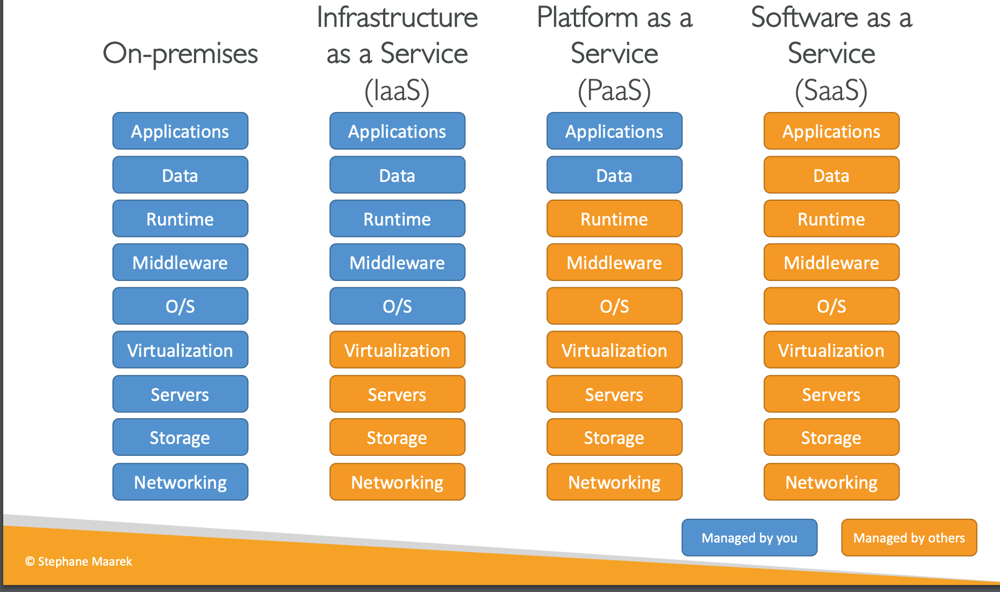
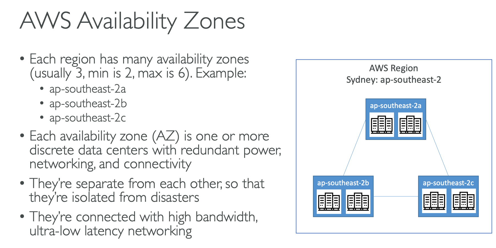
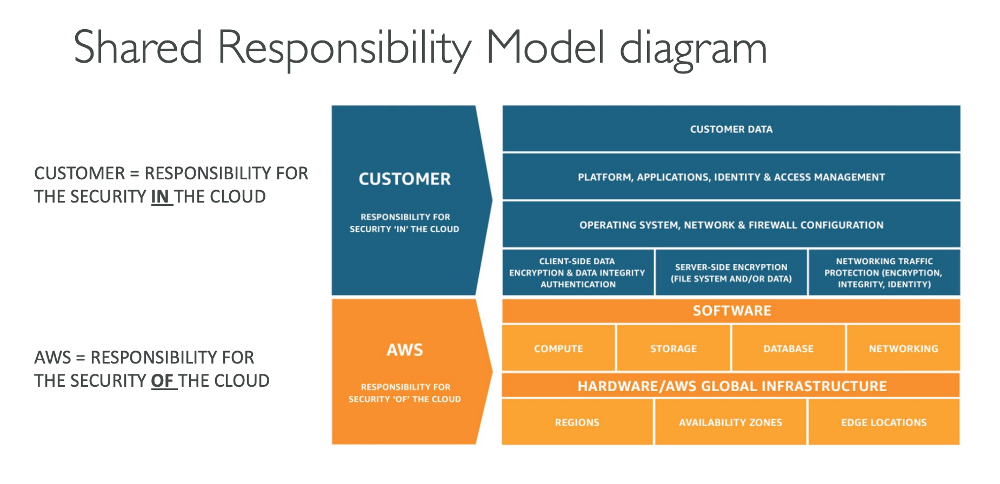

# 35Days Roadmap to AWS-CLF-C02

## Day 1 - Server composed with below :
* CPU + RAM =  Brain *(When we think of something we are doing computation like CPU and then we have to remember that which is like storing data in RAM)*
* Storage
* Database
* Network 

### Section 3 - What is cloud Computing
#### Traditional IT Overview 
* Before, company would work like this: 
    * Buy servers and other equipement for data center
    * Pay rent for data center
    * Hire maintaiance guy for server

* Disadvantage
    * Hard to scale (Intense time consuming) -> if need to add server, have to do following: 
       ```markdown
        order it -> install OS and configuration -> dedicate a physical space 
        ```

-----   
## Day 2 - Cloud Computing
*   On-demand Delivery of you get it when you need it (computer powert, db storage, applications and other IT resources)
*   Pay as you go feature
* Access resources as you need, almost instantly

#### Depployment Models of the Cloud
* Private Cloud : Not exposed to internet, still maintained by third party like rackspace (Not important for exam)
* Public : aws, azure, google cloud
* Hybrid : Some resource in on-prem and some on public cloud like aws

#### Five Characteristics
*   On-demand self service
* Broad network access
* Multi-tenancy and resouce pooling: Resources Shared with other customer still everyone having their own security and privacy and not affecting each other
*   Rapid Elasticity and scalability

#### Six Advantages 
* CAPEX(Trade Capital expense) for Operational expense (OPEX) : Hardware not owned , only rent for operation
* No need to guess usage as cloud can scale .
* Benefit from massive economies of scale : Huge customer base so cost for AWS is less to rent it's resource to users
* Increase speed and agility
* No cost to maintain and run datacenter
* Go Global in minutes

#### Problems solved by cloud
 * Flexibility
 * Cost-Effective
 * Elasticity : Add more or reduce resources as needed on real-time - **Short term effect**
 * Scalability : If anticiated to have large volume of load we can increasing system power(more computation power, increase RAM) or add more resources like server  - **Long Term effect**
 * High-avaliability and fault-tolerance

 ### Types of Cloud Computing

* **Infrastructure as a Service (Iaas)** ->  Raw resource - More flexibility also more responsibility 
-> eg :  Lego blocks, we have to build different shapes as we need
*  **Platform as a Service (PaaS)**  -> Limited flexibility but little less responsibility -> 
 eg :  Lego blocks whose base are prebuilt for us, we need to add the remaining part to complete
* **Software as a Service (SaaS)** -> no resposibility->  eg:  Lego blocks that are in fully built set in wide range of options for us to pick and play. 




## Day 3 - AWS Important Concepts

#### AWS Regions
* AWS Regions : Group of AZ that are connected together
* **One region = Multiple AZ** 


* Most AWS Services are going to be region specific
    ```
    eg: if we have a service in east region, when starting same service in west it will be like starting from scratch.
  
  ```

#### How to choose an AWS region?
 * Compliance : Some countries or region might have a law that states data of a country should never leave a country.
 * Latency : Application that is on a region where your customer are could improve latency as its proximity is closer.
 * Region specific service : Some region might have service that is only avaiable to that specific region and not others
 * Pricing: Service cost might vary region to region

#### AWS Availability Zones (AZ)
* **One AZ = multiple Data center**
* **One region = Multiple AZ** 
* **Important** : If one AZ goes down another one is not affected


#### AWS Shared Resposibility



### Question
1) If az are not in synced what is advantage of using it? 
* If application is setup for high availability, AWS automatically takes of routing traffic to a different AZ if one is down without human configuration required.

* Also some services like S3 have data automatically replicated across multiple AZ in a region without human configuration required.
----- 

## Day 4 - IAM

#### IAM
* Global Service , not region specific
* Group can only contain users not group -> Nested group not allowed bascially
* Users can belong to multiple group
* Policies: JSON Doc that is used to define permission of the user
* Least privilige principle - try to give as minimum access as possible - don't give permissin user don't need
* Not mandatory for users to be part of group

  

#### Resources
https://docs.calebsargeant.com/en/latest/_downloads/e453ca3d882322df71a45024ecc4dbed/AWS%20Certified%20Cloud%20Practitioner%20Slides%20v2.11.0.pdf
